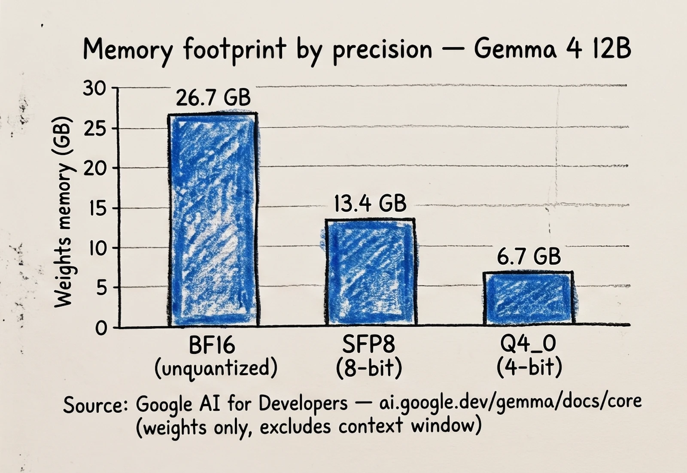
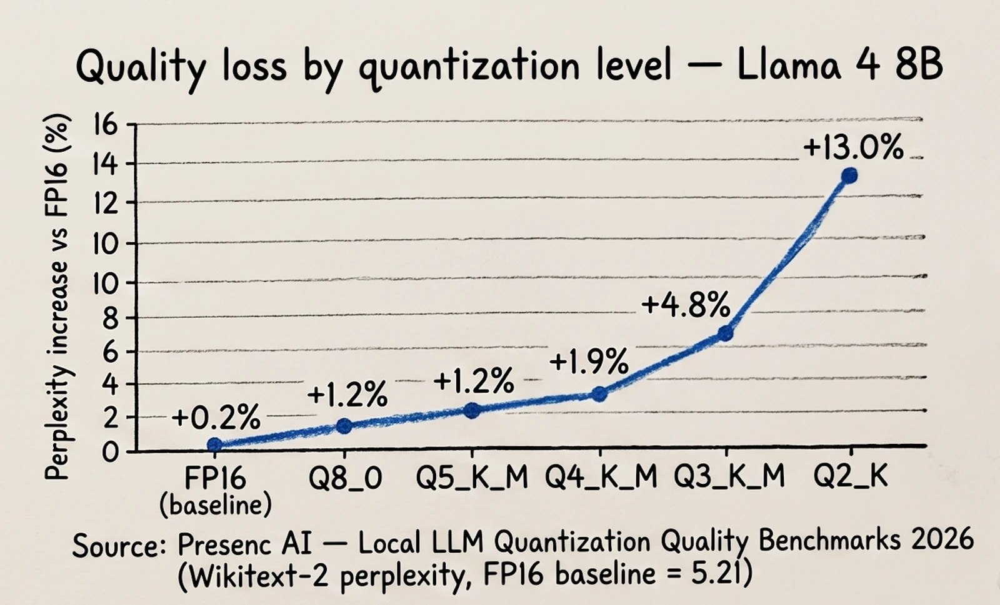
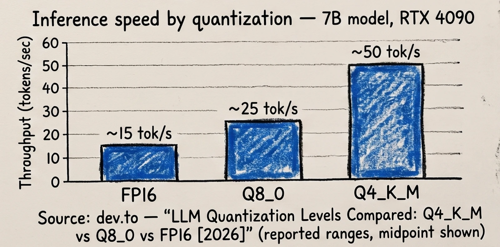

*An engineer's take on precision, memory, and quality for local LLMs — with Qwen, Gemma, and Ollama as the running examples*

Run `ollama pull qwen2.5` and you'll have a model chatting with you in a couple of minutes. What most people don't stop to check is *which* model they just downloaded — because Ollama, by default, hands you a quantized version, not the one the lab actually trained. That default is usually a fine choice. But "usually fine" is doing a lot of work in that sentence, and as an engineer shipping something on top of a local model, you should know exactly what you're trading away and when that trade stops being fine.

## What quantization actually is

A model's weights come out of training as 16-bit floating point numbers (BF16 or FP16) — that's the unquantized, full-precision form. Quantization takes those weights and represents them with fewer bits — 8-bit, 4-bit, sometimes 3 or 2 — trading numeric precision for a smaller file, less memory, and faster inference. The weights don't get "worse" in the sense of being corrupted; they get *rounded*, and rounding a few billion numbers down from 16 bits to 4 bits inevitably loses some information. The engineering question is how much information, where it hurts, and whether you can afford it.

Not all quantization is equal, and this is where a lot of local-LLM confusion comes from. A naive round-to-nearest 4-bit scheme (`Q4_0` in GGUF terms) applies one scale factor per block indiscriminately. Modern **k-quants** (`Q4_K_M`, `Q5_K_M`, `Q6_K`) instead mix precision within the model — keeping more bits where they matter (certain layers, certain tensor types) and going leaner elsewhere. As one write-up on the format puts it plainly: "Q4_K_M is fundamentally different from Q4_0," and that difference is most of the reason `Q4_K_M` has become the de facto default across the GGUF ecosystem instead of the older flat schemes.

## The memory you get back

The most immediate, easiest-to-see effect of quantization is memory. Google publishes this cleanly for **Gemma 4**, which ships official quantization-aware-trained (QAT) variants alongside the full-precision release — so you don't have to trust a third-party quantization job, the lab did it themselves:



Going from BF16 to an 8-bit QAT variant roughly halves the memory. Going to 4-bit roughly halves it again. For a 12B model, that's the difference between needing a serious GPU and running comfortably on a single consumer card — or, at the small end of Gemma's lineup (the E2B/E4B "effective parameter" models), running on a phone at all.

## The quality you give up

This is the part worth actually internalizing rather than skimming, because the loss isn't linear and it isn't uniform across tasks. Here's how perplexity — a standard measure of how well a model predicts held-out text, lower is better — moves across quantization levels for Llama 4 8B, a case with a full published spread from FP16 down to Q2_K:



The curve tells you almost everything you need to know: from FP16 to Q8_0 the loss is close to rounding error (+0.2%). Q5_K_M and Q4_K_M stay under 2%. Then Q3_K_M and especially Q2_K fall off a cliff. Qwen 3 32B shows the same shape at a different scale — FP16 perplexity of 4.78 moves to 4.87 (+1.9%) at Q4_K_M and 5.02 (+5.0%) at Q3_K_M — which is reassuring in the sense that the pattern isn't specific to one model family; it's a property of how aggressively you're rounding.

The part that catches engineers off guard: **perplexity understates the damage on reasoning-heavy tasks.** On GSM8K-style math benchmarks, the same benchmarking work found accuracy drops roughly three times faster than perplexity would suggest at the same quantization level — an 8B model that loses ~5% on perplexity at Q3_K_M can lose noticeably more than that on multi-step math or code generation. If your use case is "summarize this document," Q4_K_M is close to free. If it's "write and debug this function," the margin is thinner than the perplexity number implies, and it's worth running your own eval on your own task before trusting a generic benchmark.

## The speed you get back

Smaller weights aren't just smaller — they move through memory bandwidth faster, which is usually the actual bottleneck during local inference, not raw compute:



Going from FP16 to Q4_K_M on a 7B-class model roughly triples throughput on the same consumer GPU. That's the practical reason Q4_K_M became the ecosystem default: it isn't just "good enough" quality, it's also the difference between a model that feels conversational and one that feels like you're waiting on it.

## How this actually shows up when you run Ollama

Ollama's model tags encode the quantization directly: `model:parameters-variant-quantization`. So `qwen2.5:7b-instruct-q4_K_M` and `qwen2.5:7b-instruct-fp16` are, in a real sense, different artifacts pulled from the same source — same architecture and training, different rounding. When you run `ollama pull qwen2.5` with no tag, you get the model's default tag, which for most models in the library is Q4_K_M — chosen precisely because it's the balance point described above.

```bash
# Ollama's default pull — usually Q4_K_M under the hood
ollama pull qwen2.5

# Explicit: the balanced default, spelled out
ollama pull qwen2.5:7b-instruct-q4_K_M

# Explicit: a higher-quality 8-bit step, more VRAM
ollama pull gemma2:9b-instruct-q8_0

# Explicit: full precision — no quantization at all
ollama pull qwen2.5:7b-instruct-fp16

# Run whichever you pulled
ollama run qwen2.5:7b-instruct-q4_K_M
```

If you've only ever typed `ollama pull <model>` and moved on, this is worth pausing on: you've been making a quality/memory/speed decision by default, without necessarily deciding it on purpose.

## A field guide for picking a precision

**Full precision (FP16/BF16) — unquantized.** Use it as your evaluation baseline, for fine-tuning or distillation work, or when you're serving from real GPU infrastructure and the quality delta genuinely matters (say, a reasoning-heavy production feature). Don't default to it on a laptop; you're paying for headroom you usually don't need.

**Q8_0 — near-lossless.** The right call when you want to be conservative about quality but still want the memory savings of quantization — code-heavy or precision-sensitive tasks where the ~5 percentage point gap between Q8_0 and Q4_K_M on something like code generation is worth the extra memory.

**Q4_K_M — the practical default.** For most local development, prototyping, and general-purpose assistants, this is the Pareto-optimal point: roughly 95–97% of FP16 quality, about a third of the memory, multiple times the throughput. This is why it's Ollama's default for a reason, not by accident.

**Q3_K_M and below — only when you have no other choice.** Reach for these when memory is the hard constraint — an 8GB GPU, an old machine, an edge device — and accept that reasoning and math tasks will show real, user-visible degradation. Validate against your actual task before shipping it, not just against a perplexity number.

## The takeaway

"Quantized vs. unquantized" isn't a binary — it's a dial, and every model you pull has that dial set somewhere whether you looked or not. The engineering discipline here is small but easy to skip: know what tag you actually pulled, know roughly where it sits on the memory/quality/speed curve, and validate quality on the kind of task you actually care about rather than trusting a generic perplexity number to speak for your use case.

---

## Sources

- [Gemma 4 model overview — Google AI for Developers](https://ai.google.dev/gemma/docs/core)
- [Local LLM Quantization Quality Benchmarks 2026 — Presenc AI](https://presenc.ai/research/local-llm-quantization-quality-benchmarks-2026)
- [LLM Quantization Levels Compared: Q4_K_M vs Q8_0 vs FP16 [2026] — DEV Community](https://dev.to/kunal_d6a8fea2309e1571ee7/llm-quantization-levels-compared-q4km-vs-q80-vs-fp16-2026-3kg2)
- [Qwen 3.6 Quantization Deep Dive: BF16 vs GGUF, Q4_K_M vs Q8_0](https://dasroot.net/posts/2026/05/qwen-36-quantization-bf16-gguf-q4-k-m-q8-0/)
- [GGUF Quantization: Q4_K_M, Q8_0, IQ4_XS for Ollama](https://webscraft.org/blog/kvantuvannya-gguf-dlya-ollama-scho-oznachayut-q4km-q80-ta-iq4xs-yake-vibrati-pid-svoye-zalizo?lang=en)
- [Ollama Quantization Explained: Q4 vs Q5 vs Q8 and How to Choose — ML Journey](https://mljourney.com/ollama-quantization-explained-q4-vs-q5-vs-q8-and-how-to-choose/)
